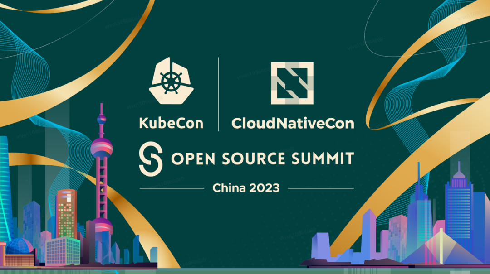
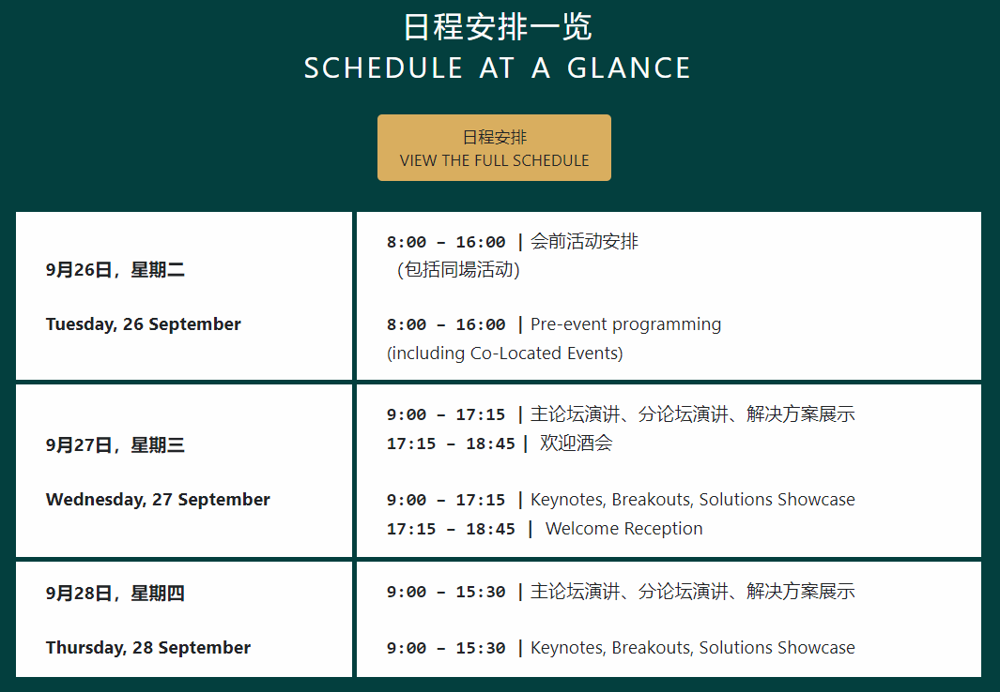
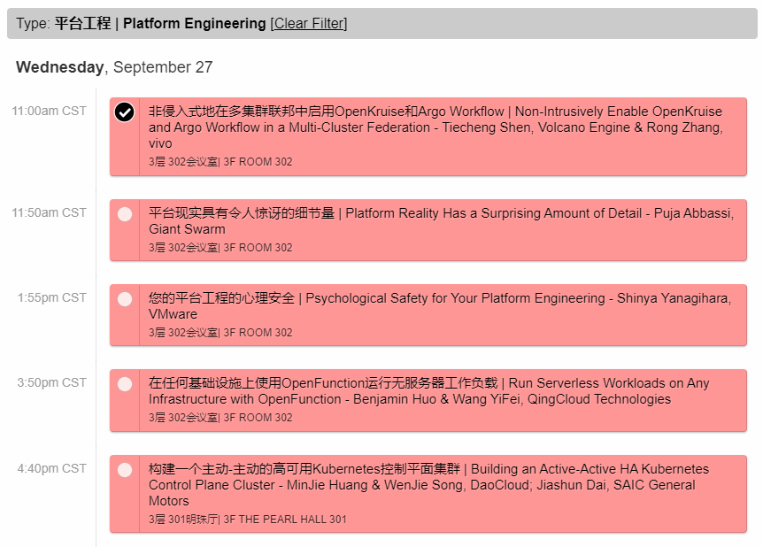
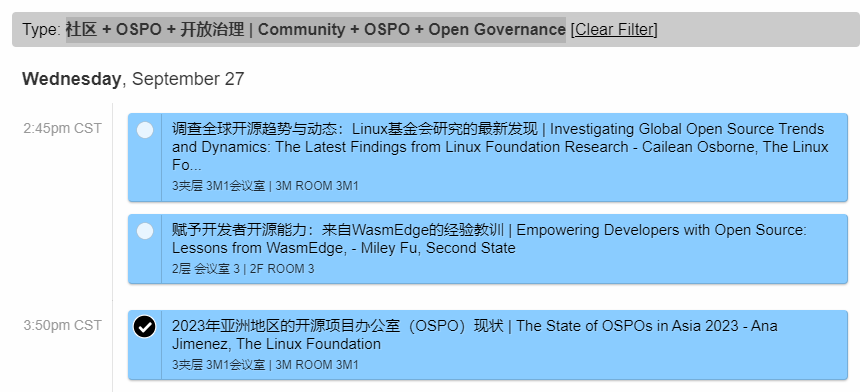
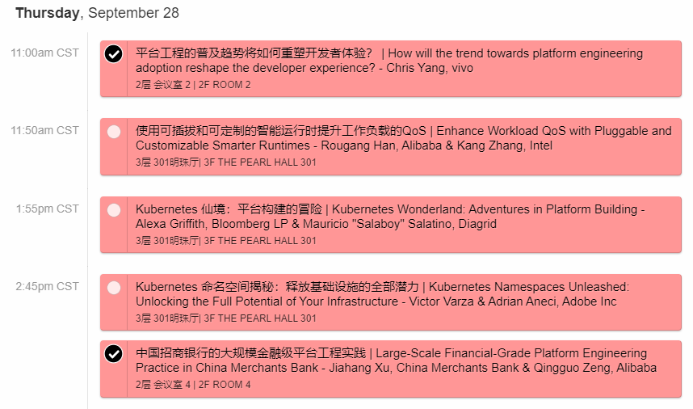

云原生计算基金会 CNCF(https://www.cncf.io) 的旗舰会议将于2023年9月26日至28日在中国上海召开，聚集了来自领先的开源和云原生社区的采用者和技术人员。加入CNCF毕业和孵化项目（https://www.cncf.io/projects/），与社区一起共聚三天，推动云原生计算的教育和发展。

浏览会议官网，[查看详细日程](https://www.lfasiallc.com/kubecon-cloudnativecon-open-source-summit-china/program/schedule/)

## 我本次参会的行程如下：

### Day 1: 9/26 

- 上午 深圳飞往上海，
- 中午 到达，
- 下午 签到和参加同场活动，
- 晚上 参加理事会/演讲者/贵宾等的招待会。

### Day 2: 9/27 
- 上午 在 【平台工程】专题学习，以及社交（希望为平台工程社区纳新），

- 下午 参加 【社区 + OSPO + 开放治理 | Community + OSPO + Open Governance】专题的学习，以及社交（会见到很多开源圈特别是OSPO的同行）

- 晚上 参加 TODO Group 组织的 BoF 活动。

### Day 3: 9/28 

- 上午 在 【平台工程】专题学习，并于11点进行我自己的分享，

- 下午 在【平台工程】专题学习，以及社交。
- 晚上 上海飞回深圳。（第二天就放国庆长假了，本次是全神贯注参会，毫无空隙时间去逗留或与在上海的亲朋见面 :）

## 下面是关于我所分享议题的介绍：

### 平台工程的普及趋势将如何重塑开发者体验？

随着IT行业及大环境的快速多变，平台工程在多种因素促进下持续火热，从开发人员、运维人员到技术Leader，从业务到平台，从大型科技企业到中小组织，甚至到产品经理，都在关注和讨论。

经过50多年的发展，软件工程行业来到了一个跃迁边缘，平台工程即将成为这种临界态的推动因素之一。回归到软件开发本质论的角度思考，软件的本质目的是解决问题和提供价值，而软件开发活动则是由人组织各项资源来实施。那么，在我们希望提升开发效率和质量的时候，人就成为需要考虑的第一要素，而平台工程给开发者体验带来了一次绝佳的重塑机会，以至于有观点表示 “这是开发者最好的时代！”

1. 平台工程现状概览 ：关键事件与时间轴
1. 平台工程的 WHAT 和 WHY
1. 平台工程与开发者体验
1. 重塑开发者体验：Developer First | Developer Control Plane | Developer Journey
1. 当前挑战与未来趋势

## Fun time
- 我在背包上张贴了 OSPO 的徽章缎带 
- 我计划穿的“战服”：一件带有 “For Platformers !” 字样的定制T恤，希望后续可以成为平台工程社区的周边之一。

**期待与你在上海见面！**

### 更多资料
- 平台工程社区 https://pecommunity.cn 
- 会议详细日程 https://www.lfasiallc.com/kubecon-cloudnativecon-open-source-summit-china/program/schedule/ 
- 平台工程列表 https://github.com/PECommunity/awesome-platform-engineering 
- 平台工程术语表 https://github.com/PECommunity/Platform-engineering-glossary 

更多平台工程信息，可关注公众号 @平台工程洞察  
