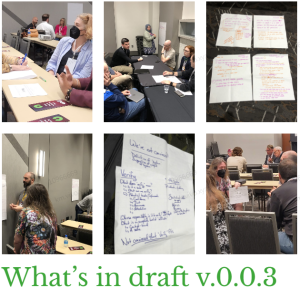

近日OSI发布博文：[以《开源人工智能定义》初稿为 2023 年深入探讨人工智能画上句号](https://blog.opensource.org/closing-the-2023-rounds-of-deep-dive-ai-with-first-draft-piece-of-the-definition-of-open-source-ai/)，回顾了本年对在开源AI定义上的努力并介绍了当前的最新成果。

深度探讨开源人工智能一事自2022年就在进行，由GitHub牵头，DataStax,Google参与，并在当年底发布了[报告](https://deepdive.opensource.org/wp-content/uploads/2023/02/Deep-Dive-AI-final-report.pdf)，主要内容如下：

### 概述
- 人工智能和机器学习简介
- 人工智能的威力：有什么可怕的？
- 数据集的重要性难以置信
- AI/ML模型的神秘“黑匣子”
- 我们该如何管理人工智能的风险？
- 开源的作用和人工智能民主化的价值
- 下一步是什么？解决我们最紧迫的问题
- 致谢：深入探讨：人工智能 贡献者和赞助商

来到2023年，OSI继续在推进这项工作，其在官网通过时间线记录了整个过程，并表示：是时候有一个明确的定义了，我们正在推动一个多方利益相关者流程来定义“开源人工智能” 。今年的参与者包括了Amazon、GitHub、Google Open Source以及OSSC、GitLab、Sourcegraph和Weaviate。

#### 开放的流程
此次深度探讨是一系列现场和在线活动，收集开发和使用人工智能系统的个人开发者、律师、研究人员、非营利组织、公司和政府官员的意见和评论。

#### 宏伟的目标
OSI 正在召集全球专家，制定一套共同的原则，为人工智能从业人员重新创建无许可、务实和简化的合作，这与开源定义所做的工作类似。

你可以在 https://opensource.org/deepdive/#timeline 查看所有公开流程与记录。

OSI在其近日的博文中重点介绍了v0.0.3的主要内容及更新点，截止目前v0.0.4版本草稿已经出炉，以下是全文：

v0.0.4版本草稿 https://opensource.org/deepdive/drafts/the-open-source-ai-definition-draft-v-0-0-4/

v0.0.4草稿起始

---

注：本文件由三部分组成：序言，说明本文件的意图；开源人工智能本身的定义；以及评估许可证的清单。

本文件遵循经济与合作发展组织（OECD）对人工智能系统的定义：
人工智能系统是一种基于机器的系统，针对显式或隐式目标，从接收到的输入推断如何生成可以影响物理或虚拟环境的输出，例如预测、内容、建议或决策。不同的人工智能系统部署后的自主性和适应性水平各不相同。

有关 AI 系统定义的更多信息，请访问 OSI 博客。

### 前言
为什么我们需要开源人工智能 (AI)
开源已经证明，当您消除学习、使用、共享和改进软件系统的障碍时，每个人都会受益匪浅。这些好处是使用遵守开源定义的许可证的结果。其好处可以归结为自主性、透明度和协作改进。
每个人都需要人工智能的这些好处。我们需要基本的自由，使用户能够构建和部署可靠且透明的人工智能系统。

**超出范围的问题**

开源人工智能定义没有说明如何开发和部署一个道德的、值得信赖的或负责任的人工智能系统，尽管它并没有阻止它。是什么让人工智能系统道德、负责任、值得信赖或有效，这是一个单独的讨论。我们支持解决这些问题的努力，包括通过适当的政府监管。

### 什么是开源人工智能

要实现开源，人工智能系统需要根据法律条款提供，并授予以下自由：

将系统用于任何目的，无需征求许可。

研究系统如何工作并检查其组件。

出于任何目的修改系统，包括更改其输出

共享系统以供其他人出于任何目的进行修改或不修改使用。[提供一个基于机器学习的示例？]

### 评估许可证的清单
待定

---

v0.0.4草稿结束

让我们共同关注和期待最终版本的发布，如果可能，也非常欢迎你的参与和评论。

### 相关链接

- OSI 官网 https://opensource.org/
- 定义开源AI https://opensource.org/deepdive/
- 2022深入探讨AI 最终报告 https://deepdive.opensource.org/wp-content/uploads/2023/02/Deep-Dive-AI-final-report.pdf
- 2023深入探讨AI 总结回顾 https://blog.opensource.org/closing-the-2023-rounds-of-deep-dive-ai-with-first-draft-piece-of-the-definition-of-open-source-ai/
- 开源AI定义v0.0.4版本草稿  https://opensource.org/deepdive/drafts/the-open-source-ai-definition-draft-v-0-0-4/
- 开源AI定义v0.0.3版本草稿 https://hackmd.io/@opensourceinitiative/osaid-0-0-3  

PS: 本文所引用的OSI相关内容旨在传播开源及相关行业动态，其知识产权许可以OSI官网声明为准。
