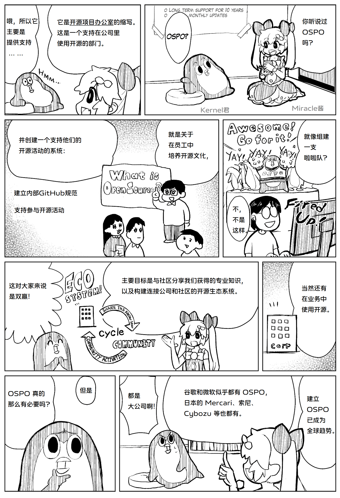
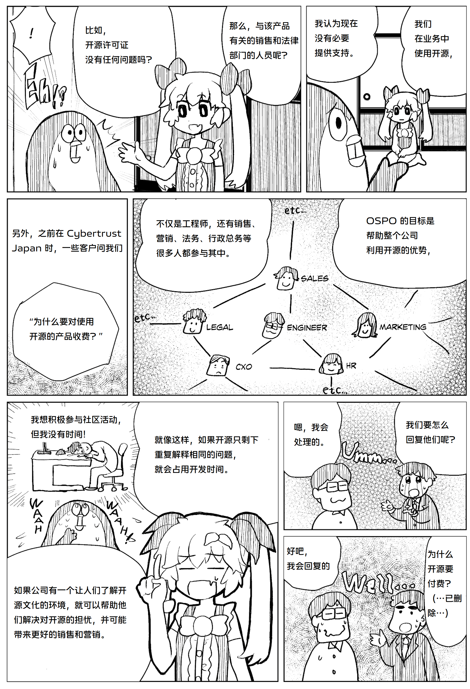

## OSPO 介绍 漫画版
此前发布过的[【OSPO 漫画：来自日本OSPO Summit 2023的分享】](/blog/ospo-comic)，近期终于抽时间完成了中文版翻译。原作品使用日语和英语发布在 https://www.miraclelinux.com/miracle110/miracle-chan 及X平台，使用CC BY-SA 4.0许可；中文版是基于英语版本翻译而来，已和原作沟通，后续也会同步发布到X平台。

#### OSPO = Open Source Program Office，即 开源项目办公室，也称为开源办公室。

