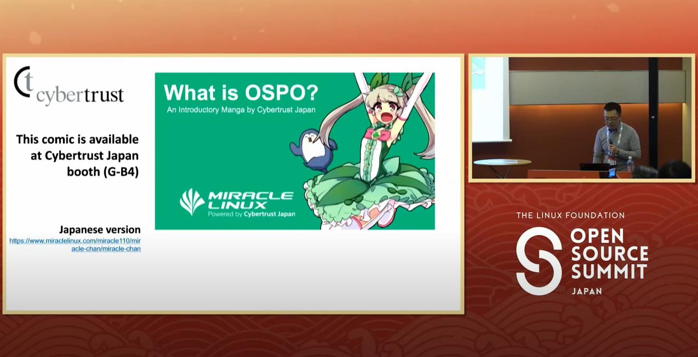
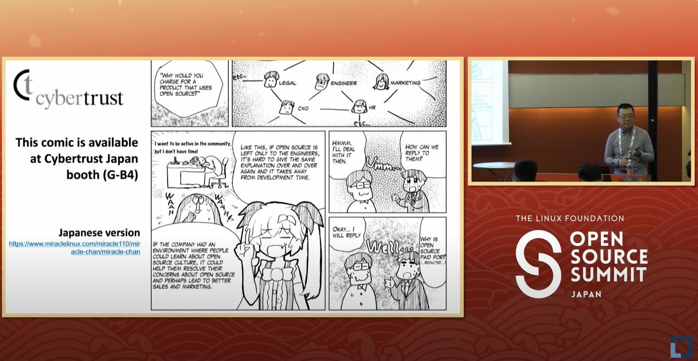
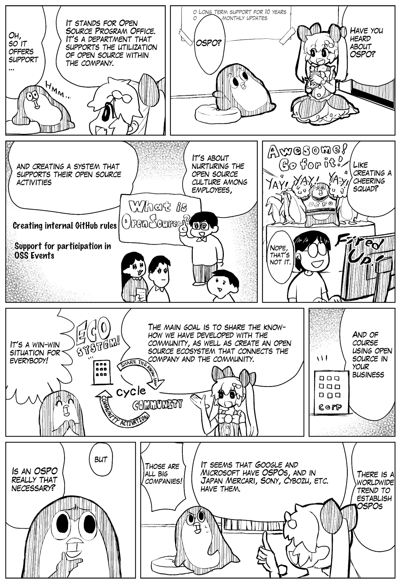
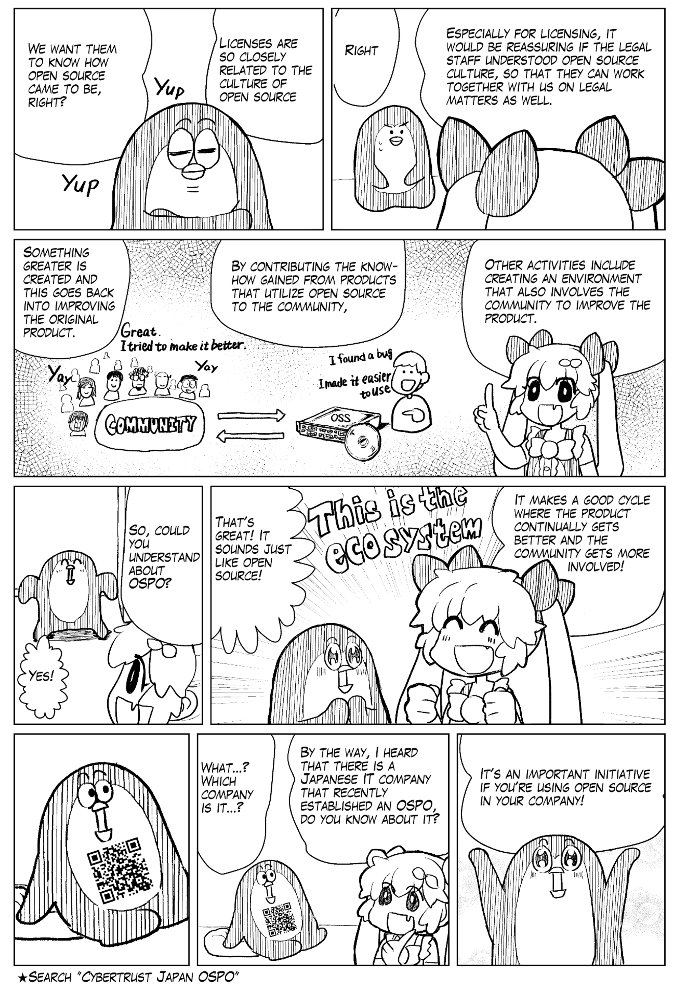

## OSPO 漫画：来自日本OSPO Summit 2023的分享

日本OSPO Summit 2023上的一个Panel开始前，有一个简短的分享，主要介绍了 OSPO 漫画及OSPO常见问题。

<!-- truncate -->

- 视频回看 https://www.youtube.com/watch?v=sD5lHd8IuPA&list=PLbzoR-pLrL6qXeJIfCU2YvmVgP6IQYZE1&index=4 
- 漫画（日文和英文版）最初发布地址 https://www.miraclelinux.com/miracle110/miracle-chan/miracle-chan  

从该分享我们可以看到，企业在 OSPO 实践中确实会遇到各种各样的挑战，而开源文化和OSPO 科普是非常重要的基础工作。希望我们国内的企业在使用和受益于开源的同时，也越来越多地关注开源、参与开源、贡献开源，共同推进企业开源治理与 OSPO 实践，一起加入到开放式协作与创新浪潮中。

