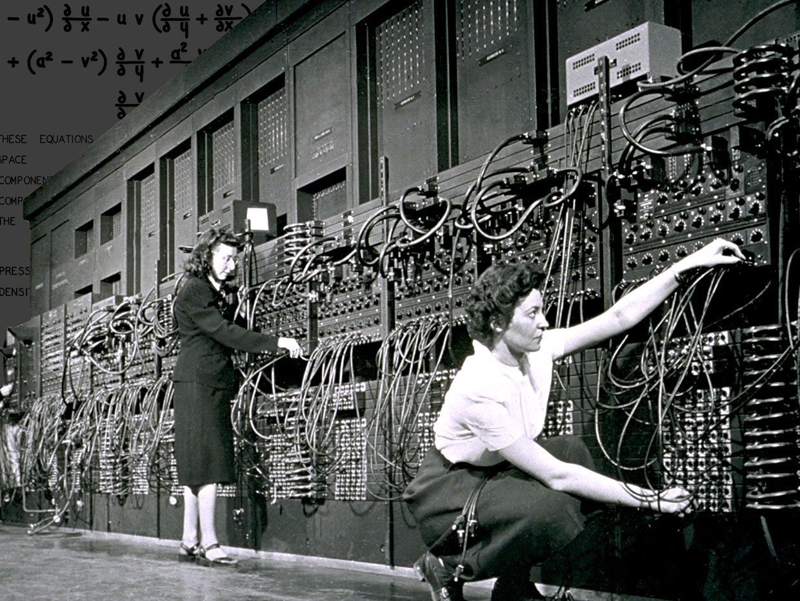
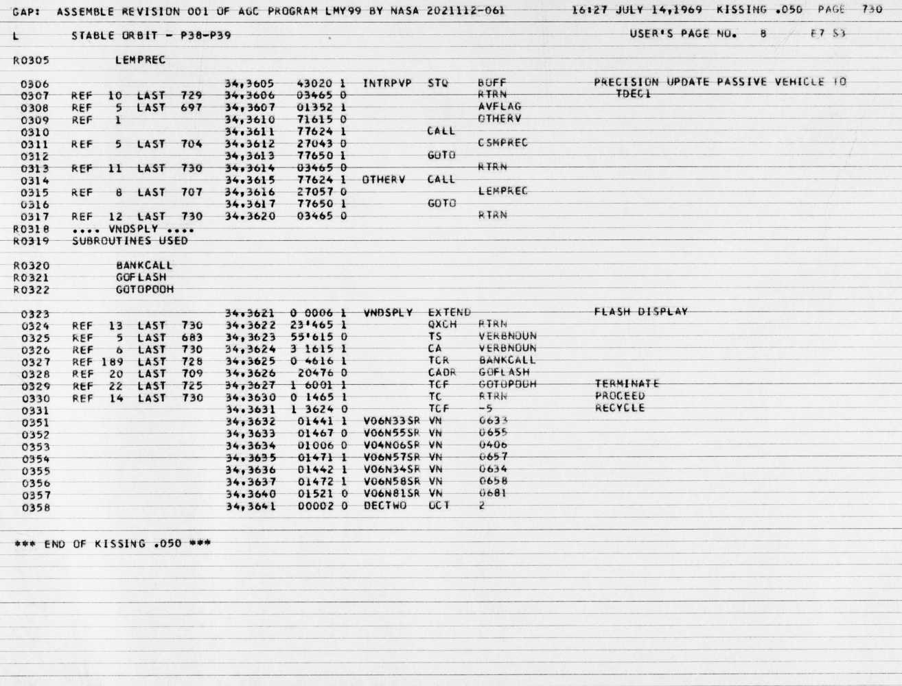
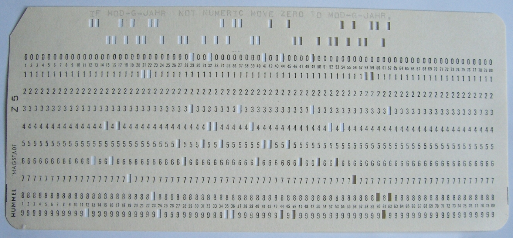
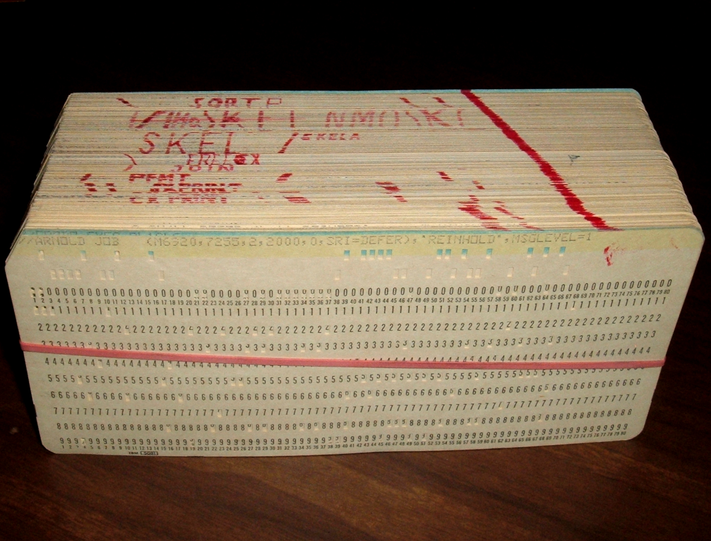
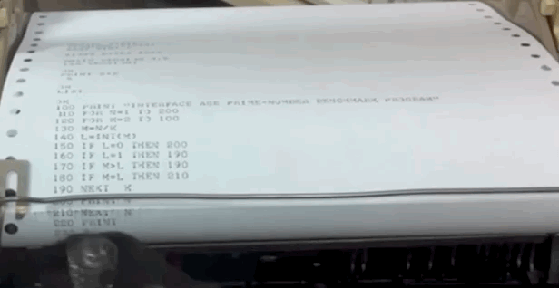
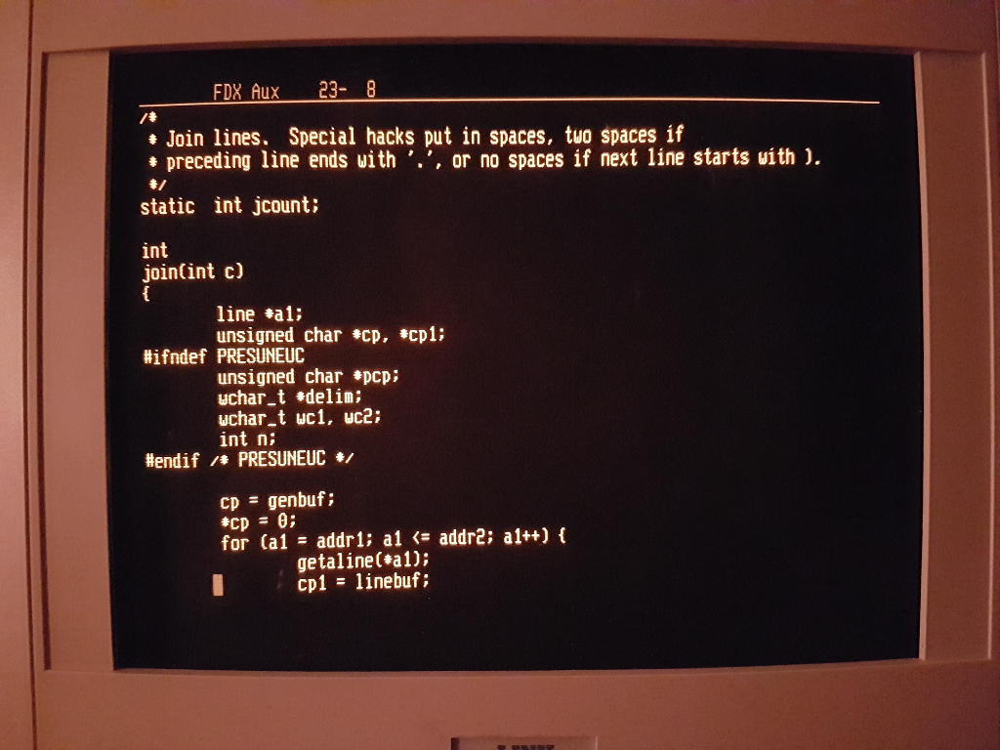
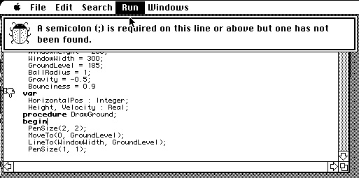
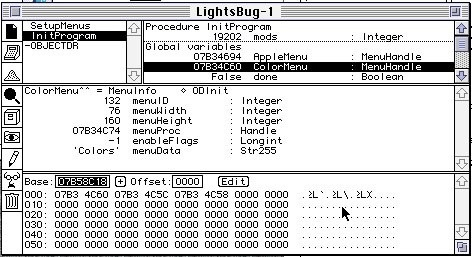
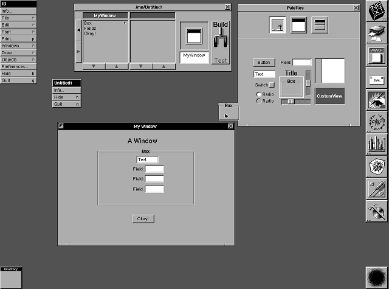
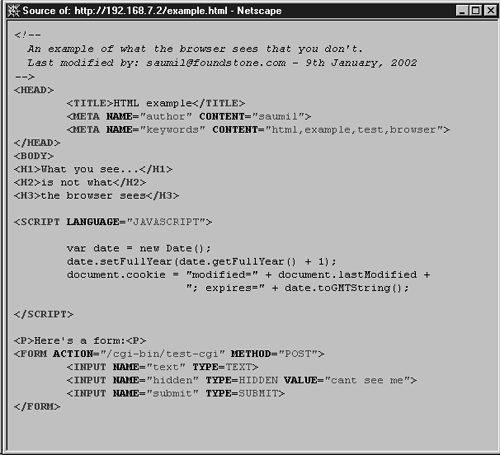

```
原文 https://wanderingstan.com/2020-02-04/the-evolution-of-developer-experience-in-the-20th-century
作者 stan james (已书面获得作者授权翻译及发布)
翻译 杨振涛
```

# 翻译：20世纪的开发者体验简史

一个做营销的朋友曾在我写代码的时候，看着我的屏幕说：“看起来太可怕了！” 这引发了我的思考，我们是如何进入到这个看起来奇奇怪怪的彩色字符与黑色美学世界的。正因如此，才有了这篇开发者体验简史。

## 起源 

Ada Lovelace 在1842年编写了第一个计算机程序。由于当时实际上并没有计算机，因此该程序从来没有运行过。不过当看到她如何在纸上实现算法时，就会发现这是一项令人着迷的、史无前例的开创性工作。


[Wikipedia](https://en.wikipedia.org/wiki/Ada_Lovelace#/media/File:Diagram_for_the_computation_of_Bernoulli_numbers.jpg)

这是为查尔斯·巴巴奇（Charles Babbage）的分析引擎计算伯努利（Bernoulli）数字的程序，这在数论中很重要。


## 电线和文字错误（1940年代）

第一台计算机是在1940年代建造的，它是通过连接电线、转动表盘和切换开关来编程的。所谓“编程”只是一种特殊的“接线”工作。当时并没有做其他使人类编程更容易的任何努力，因为这些机器能够存在就已经足够了！



为 [ENIAC计算机](https://ieeexplore.ieee.org/stamp/stamp.jsp?arnumber=8467000) 编写程序


这个时代还给我们带来了BUG（程序错误或漏洞）的概念。第一个 BUG 是一只飞蛾（字面意思）造成继电器短路。格蕾丝·霍珀（Grace Hopper）在她的日志中记录了这一事件的发生及那只飞蛾。


第一个软件 [bug](https://en.wikipedia.org/wiki/Software_bug).

## 汇编语言（1950年代）

尝试减轻人类负担的第一个努力是*汇编语言*，该语言使程序员可以使用“ADD”或“JUMP”这类的更适合人类下达的指令，而不是记住诸如“523”或“10011011”之类的数字代码。但这只是非常有限的一步前进，因为程序员仍然必须知晓计算机的内外部架构。

阿波罗太空任务的代码是汇编语言的一个很好的例子，尽管它是在1960年代编写的。下面是该程序部分内容的打印输出，还有一个很有趣的名字：亲吻！


阿波罗计算机的代码 ([完整的代码库存于 Github上](https://github.com/chrislgarry/Apollo-11))

```
INTRPVP         STQ     BOFF            # PRECISION UPDATE PASSIVE VEHICLE
                        RTRN            #       TDEC1
                        AVFLAG
                        OTHERV
                CALL
                        CSMPREC
                GOTO
                        RTRN
OTHERV          CALL
                        LEMPREC
                GOTO
                        RTRN
```

## 打孔卡和高级语言（1950年代）

像 Fortran 和 Cobol 这类语言使用了准英语函数名称，例如 “if”、“not” 和 “while”，只要有合适的编译器，就可以在不同的计算机上运行。

这些第一代“高级”语言都是以相同的方式编写的：在打孔卡上。每张卡对应于一行代码，每行通常为80个字符。



人类可读的代码位于卡的顶部，我们可以从上述卡片读取到：

    IF MOD-G-JAHR NOT NUMERIC MOVE ZERO TO MOD-G-JAHR. 


一个程序由一组卡片组成。编辑程序包括打孔新卡或对该组卡片重新排序。

如下图所示，写在该组卡片侧面的“注释”，标示出了子程序。红色斜线作为一种简单粗暴的方法，以便在卡片组散落开的时候可以顺利恢复。您还可以看到旧的红色标记，标示出了该组卡片已重新排序的部分。



单个程序卡片组，标记为单独的子程序。当卡片被更换或重新排序时，这些标记能够展示编辑的影响范围。 （维基百科）

与现代语言不同，当时并没有缩进来表示块。在您一次只能看到一行的世界中，缩进毫无意义！ Fortran 语言使用缩进来区分注释（第1列）、标签（第2-5列）和语句（第7列及以后）。

```
C AREA OF A TRIANGLE - HERON'S FORMULA
C INPUT - CARD READER UNIT 5, INTEGER INPUT
C OUTPUT -
C INTEGER VARIABLES START WITH I,J,K,L,M OR N
      READ(5,501) IA,IB,IC
  501 FORMAT(3I5)
      IF(IA.EQ.0 .OR. IB.EQ.0 .OR. IC.EQ.0) STOP 1
      S = (IA + IB + IC) / 2.0
      AREA = SQRT( S * (S - IA) * (S - IB) * (S - IC) )
      WRITE(6,601) IA,IB,IC,AREA
  601 FORMAT(4H A= ,I5,5H  B= ,I5,5H  C= ,I5,8H  AREA= ,F10.2,
     $13H SQUARE UNITS)
      STOP
      END
```

### REPL 与行号（1960年代）

BASIC 计算机语言的设计是为了更加易于使用。它采用分时并行的策略开发，这使得许多用户可以通过电传打字机与一台计算机进行交互，而无需加载打孔卡。史上第一次，用户可以直接在计算机内存中编写、修改和运行程序！这是第一个 REPL，即“读取–执行-显示 循环”（read-eval-print loop）。

为此而开发的标准和协议，今天仍在开发人员的终端中使用。



(来自 [YouTube](https://www.youtube.com/watch?v=qv5b1Xowxdk))

在上图中，请注意行号的创新。与手动分类打孔卡相比，这一定是个很棒的创新！

1968年的手册中的这个例子，实现了对输入数字求平均值：

```
5 LET S = 0
10 MAT INPUT V
20 LET N = NUM
30 IF N = 0 THEN 99
40 FOR I = 1 TO N
45 LET S = S + V(I)
50 NEXT I
60 PRINT S/N
70 GO TO 5
99 END
```

## 可视化编辑（1970年代）

廉价 CRT 显示器的出现意味着开发人员不用再浪费纸张了，而改为在屏幕上写程序。此时代码编辑器 vi 和 emacs 出现了，从而开始了漫长的开发者传统项目——谁是最佳编辑的争论。（今天依然很流行的 vim 是从编写于1990年代的 vi 更新而来。）



vi 编辑器展示在 CRT 终端上的 C 程序 ([维基百科](https://en.wikipedia.org/wiki/Vi#/media/File:Vi_source_code_join_line_logic.png))

像 C 这样的新语言通过引入缩进来利用显示器的优势。在上图中，join（int c）后的行旨在表明它们在函数的范围内，for（a1…）命令后的行同样具有类似的范围声明含义。这种使用视觉空间来表示语义含义的方法是一种真正的创新，也是对人类视觉能够发现视觉对齐方式的真正启示。

这项创新还引发了缩进应当采用“Tab还是空格”、2-4-8空格以及“括号应当放在哪一行？”等无休止的“宗教战争”。

语法高亮、自动格式化和可视化调试器（1980年代）
Mac Pascal 是第一个在编辑时就检查语法错误的编辑器，而不用等到编译阶段。



它也是第一个进行语法高亮和自动格式化的编辑器。由于 Mac 一开始不支持颜色显示，因此使用粗体和斜体来突出显示。


Mac Pascal 的视频展示了语法高亮和自动缩进。

几年后，Mac Pascal 背后的公司带来了世界上第一个可视化调试器。



（译者注：此张图片在原文的连接已不可访问 https://insidelinkusa.com/wp/wp-content/uploads/2020/02/v4LightsBug.jpg ， 译者通过Google搜索到同名且符合该上下文的原图替换在此。新替换的图片所在文章链 接 http://basalgangster.macgui.com/RetroMacComputing/The_Long_View/Entries/2010/3/20_MacPascal_and_Think_Technologies.html ）


## 界面设计器、查看源代码和搜索（1990年代）

史蒂夫·乔布（Steve Job）在被踢出苹果之后，创立了 NeXT 计算机。 NextStep 操作系统对开发人员来说是开创性的，因为它将界面开发与代码编写分离。现在，你可以通过仅从调色板中拖动它而不是编写数行代码，即可实现将一个按钮添加到窗口中。该程序称为界面设计器（Interface Builder），而且今天它依然存在于 Apple 的 XCode 中，用来构建所有 iOS 应用程序。



20世纪末期，Web网络出现了。这将再次彻底改变开发者体验。

Web浏览器将开发人员的学习民主化，因为可以“查看源码”：让任何人都感到好奇的网页源代码可以立即查看！突然，每个人都有了自己的 HTML和 JavaScript 开发环境，每一个新网页都是一个新的学习示例！



1998年作为本世纪的暮光，也是 Google 的成立之年。这将成为开发者体验的无名基石，因为我们开始复制错误消息以及诸如“如何退出VIM？（https://www.freecodecamp.org/news/one-out-of-every-20-000-stack-overflow-visitors-is-just-trying-to-exit-vim-5a6b6175e7b6/ ）”这类问题，然后粘贴到搜索框里面。不过这已经是另一个话题了！


